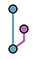
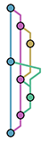
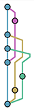
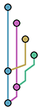
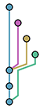

The main goal of this library is to take a linear git history, and create a structure that we can use to draw a graph of the commits/branches.

It takes a json:

```
[
  {"id": "1", "parents": ["3"]},
  {"id": "2", "parents": ["3"]},
  {"id": "3", "parents": []}
]
```

and returns a structure that represent a git graph:

```
[
  {"id":"1",
   "parents":["3"],
   "column":0,
   "parents_paths":[{"id":"3","path":[{"x":0,"y":0,"type":0},{"x":0,"y":2,"type":0}],"color":"#5aa1be"}],
   "idx":0,
   "color":"#5aa1be"},
  {"id":"2",
   "parents":["3"],
   "column":1,
   "parents_paths":[{"id":"3","path":[{"x":1,"y":1,"type":0},{"x":1,"y":2,"type":1},{"x":0,"y":2,"type":0}],"color":"#c065b8"}],
   "idx":1,
   "color":"#c065b8"},
  {"id":"3",
  "parents":[],
  "column":0,
  "parents_paths":[],
  "idx":2,
  "color":"#5aa1be"}
]
```

This structure can be directly rendered with D3.js, [you can try it out here.](http://alaingilbert.github.io/git2graph/)



### Other examples






## How to use

### Inline

`git2graph -j '[{"id": 1, "parents": ["2"]}, ...]'`

### File

`git2graph -f path/to/file.json`

### Repository

`git2graph -r` (You must be in the repository directory)

## See it in action

```
renderer/index.html
```

Use D3.js to render the graph represented by the output of Git2Graph.

## How to run

```
go run git2graph.go -j '...'
```

Or

```
go install
git2graph -j '...'
```

## How to test
```
go test
```

## TODO

- Pagination
- Colors algorithm

## How to contribute

- Fork the repo
- Create a new branch
- Make your changes
- Create new tests
- Append your name/email in git2graph.go (contributors list)
- Make a pull request :)
